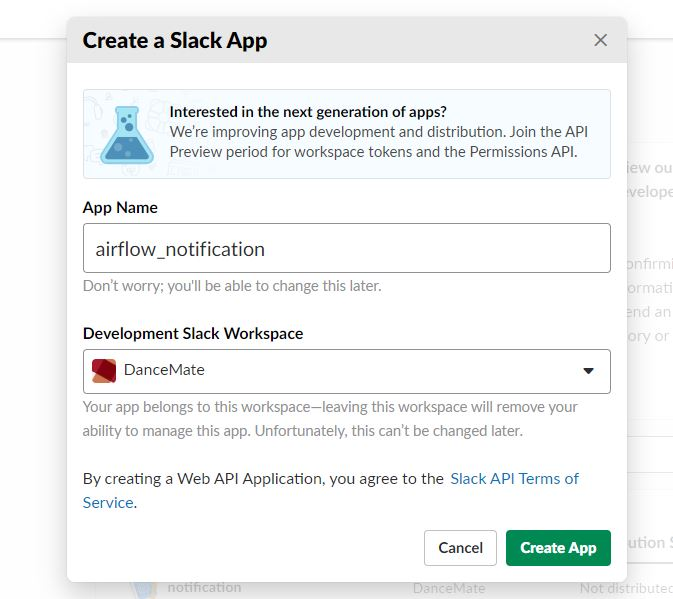
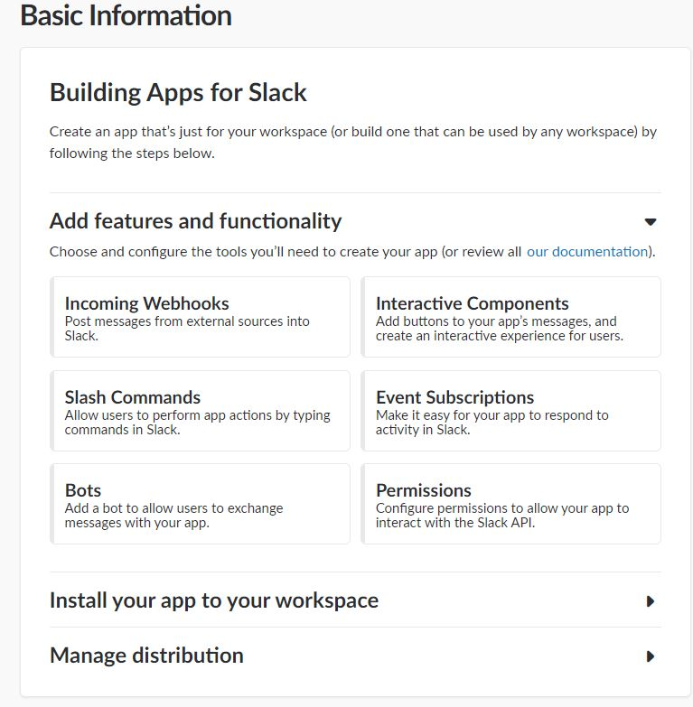
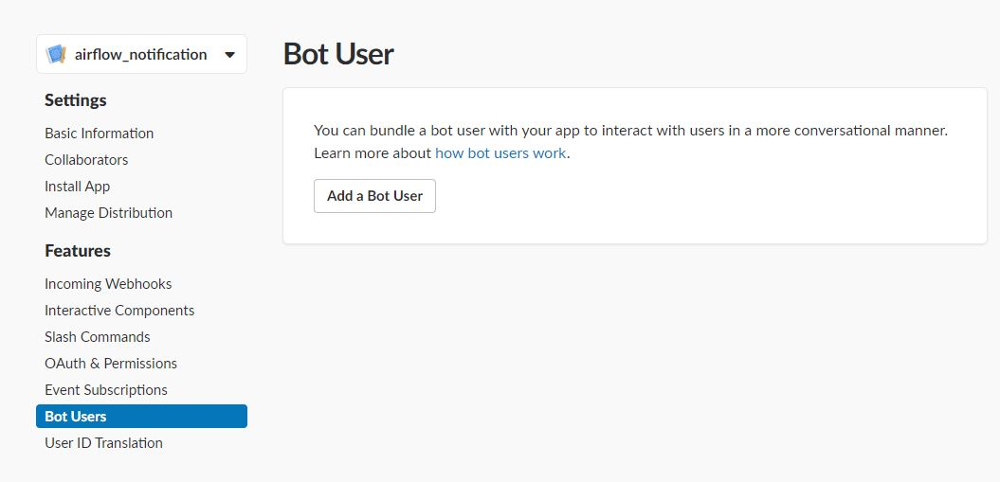
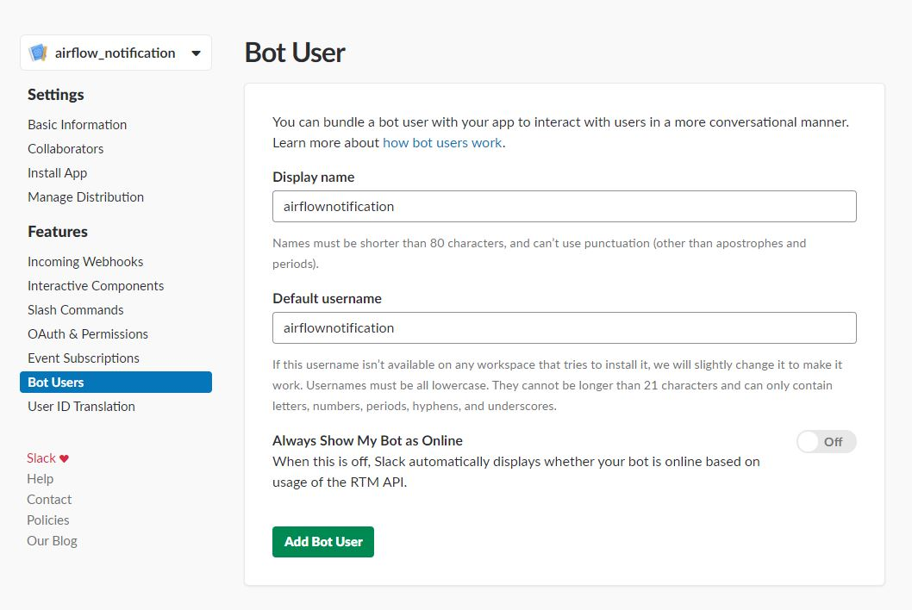
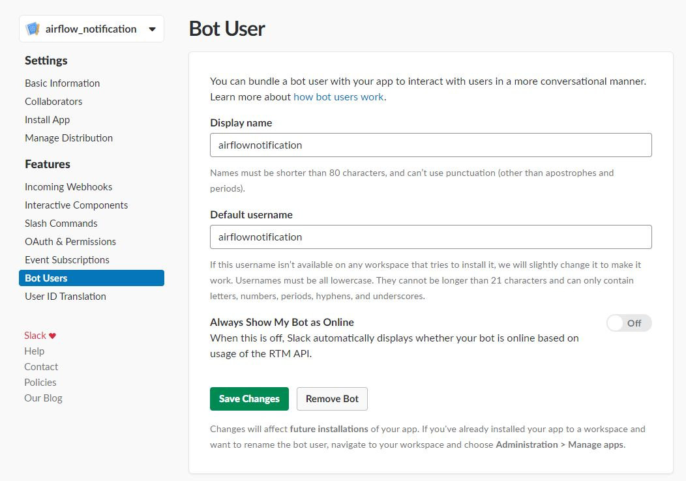
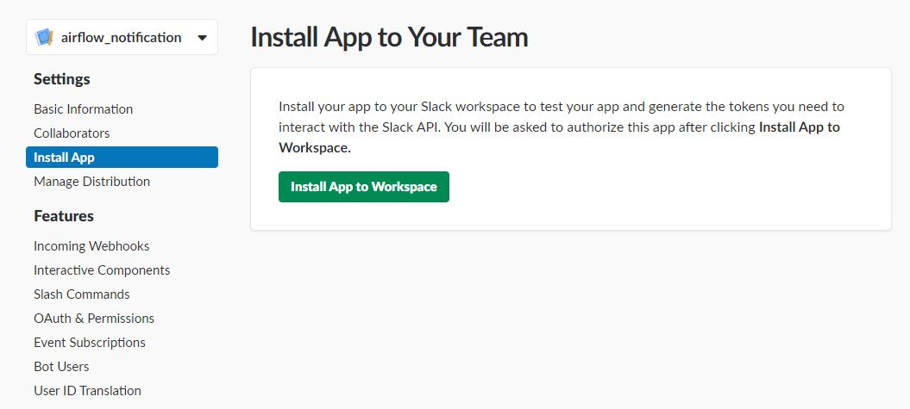
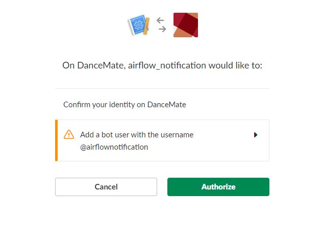
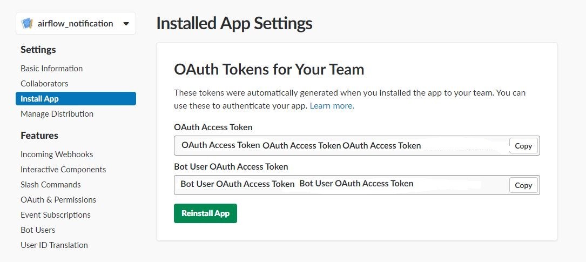

# Python Slack API 123

## Installation

  ```bash
  pip install slackclient
  ```

## Get Slack Token

* __Go to Slack__

-------------------

> ### [https://api.slack.com/slack-apps](https://api.slack.com/slack-apps)

* __Create an app__

-------------------

  

* __Add features functionalities__

-------------------

  

* __Bot user__

-------------------

  

* __Add bot user__

-------------------

  

* __Save bot user__

-------------------

  

* __Install app__

-------------------

  

* __Authorize app__

-------------------

  

* __Installed app setting__

-------------------

  

* __Add environment variable: SLACK_API_TOKEN__

  ```bash
  export SLACK_API_TOKEN=Bot User OAuth Access Token
  ```

## Documentation

* [__Python SlackAPI Document__](https://slackapi.github.io/python-slackclient/)

* [__Python SlackAPI Git Respository__](https://github.com/slackapi/python-slackclient)